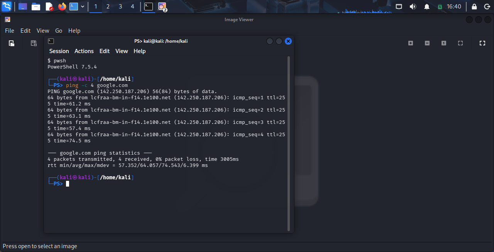
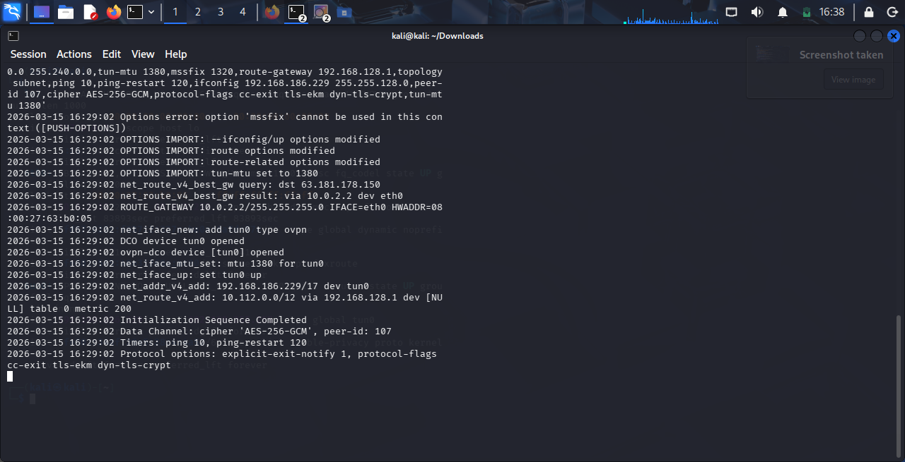
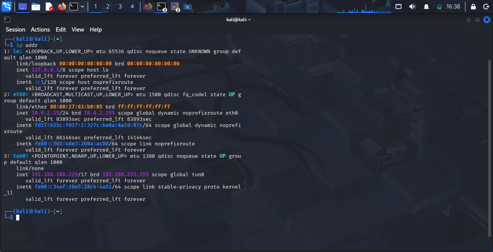
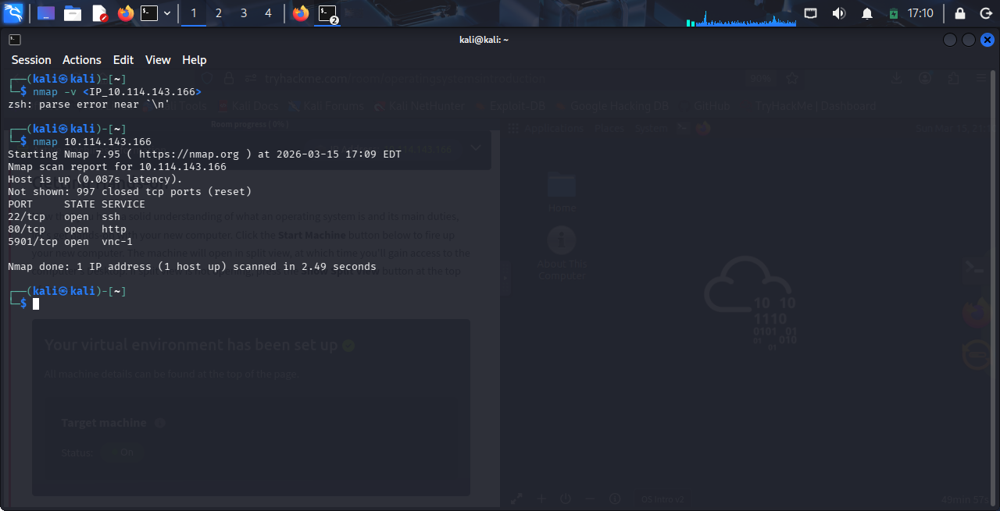

# Lab 1: Home lab setup and connectivity

## Objective:
Setup a penetration testing environment using Kali

### Tasks Performed:
* Installed Kali Linux on VirtualBox.
* Verified network connectivity using the 'ping' command.
* Documented the setup process on GitHub. 

---

# Lab 2: THM VPN Tunneling and Network Reconnaissance

## Objective:
Establishing secure connection to a remote lab environment and perform 
network scanning to identify active services on a target machine.

### Tasks Performed:
* VPN Configuration: Connected to the TryHackMe network using OpenVPN via the Kali Linux terminal.
* Interface Verification: Confirm the connection by identifying the tun0 network interface.
* Network Scanning: Used Nmap to perform a service discovery scan on a remote target.

#### Results:
* VPN Connection: Successfully initialized the tunnel.

* Target Scan discovered three open ports on the target machine:
    * Port 22 (SSH): Remote administration.
    * Port 80 (HTTP): Web server access.
    * Port 5901 (VNC): Remote desktop protocol.

---
